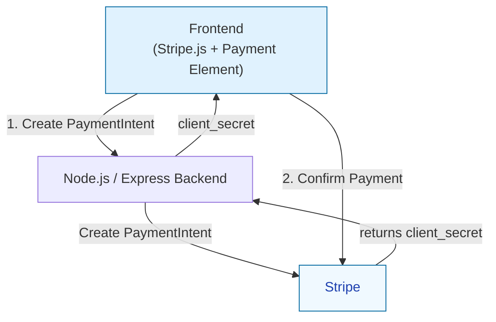

# Stripe Checkout Integration

**Author:** Alberto Martin Monjas

---

## Overview

This project implements a simple end-to-end checkout flow using Stripe to process payments for a small e-commerce bookstore.

The goal of this exercise was to integrate Stripe into an existing application using recommended best practices, keeping the solution clean, secure and extensible.

The integration uses Stripe Payment Intents and Stripe Elements, with a clear separation between frontend and backend responsibilities.

---
## Running the project locally
### 1. Install dependencies
```
npm install
```
### 2. Configure environment variables
Create a `.env` file:
```
STRIPE_SECRET_KEY=sk_test_...
STRIPE_PUBLISHABLE_KEY=pk_test_...
```
### 3. Start server
```
npm start
```
Application runs at:
```
http://localhost:3000
```
## Testing payments
Use Stripe test card:
```
4242 4242 4242 4242  
Any future expiry date  
Any 3-digit CVC  
```
After successful payment, the confirmation page will display:
* Charged amount
* PaymentIntent ID
* Status
---

## Customer Flow

The implemented flow allows a user to:

1. Select a book to purchase
2. Proceed to checkout
3. Enter payment details using Stripe Elements
4. Complete payment (using credit card or Amazon Pay)
5. View a confirmation page displaying:

   * Total charged amount
   * Payment Intent ID
   * Payment Status

---

## Stripe Payment Architecture (Elements + PaymentIntents)



### Express Backend responsibilities

* Create Payment Intent securely using Stripe secret key
* Control amount and currency server-side
* Retrieve payment details after completion
* Render confirmation page with real payment data

### Frontend responsibilities

* Render checkout UI
* Request Payment Intent from backend
* Initialize Stripe Elements using client_secret
* Confirm payment securely with Stripe.js

This separation ensures sensitive operations remain server-side and no card data ever touches the backend (app.js)

---

## Security Considerations

The implementation follows standard security practices:

* Secret keys stored only in environment variables
* PaymentIntent created exclusively server-side
* Only client_secret exposed to frontend
* Stripe Elements handles all card data
* Backend never processes raw payment details

This keeps the integration within minimal PCI scope. It is the responsibility of the implementer to review, validate, and ensure that all security requirements and compliance measures are properly met before deploying this solution to a production environment.

---


## How I approached the problem

I approached this challenge by aligning the implementation with Stripe’s current best practices for custom payment integrations. Given the requirement to use the Stripe Payment Element instead of Checkout, I structured the solution around the Payment Intents API, which provides flexibility, strong authentication support (including SCA), and extensibility for future enhancements.

My approach was incremental and architecture-driven. I followed the steps below:

1. **Understand the existing app flow**  
   I reviewed the Express routes and Handlebars rendering flow first, so the Stripe integration matched the current structure and remained simple to maintain.

2. **Implement a backend endpoint for PaymentIntent creation**  
   I added `/create-payment-intent` using the Stripe Node SDK to create PaymentIntents and return the `client_secret` needed by Stripe.js.

3. **Integrate Payment Element on checkout**  
   On the checkout page, Stripe.js is initialized, the Payment Element is mounted, and payment confirmation is handled with `stripe.confirmPayment()`, which supports authentication flows like 3DS/SCA when required.

4. **Display real payment results**  
   After redirect, the app retrieves the PaymentIntent and renders real transaction details (amount, PaymentIntent ID, status) on the success page.

5. **Keep the design extensible**  
   The structure can be extended with webhook-driven fulfillment, subscriptions, persistent orders/customers, idempotency handling, and richer multi-product/multi-currency logic.

Overall, I focused on clarity, security, and alignment with Stripe’s recommended integration patterns while keeping the solution simple, maintainable, and easy to extend.

---

## How the solution works

1. The customer opens `/` and selects a book.
2. The server handles `GET /checkout?item=<id>`, maps the item to a title + price in cents, and renders `views/checkout.hbs`.
3. The checkout page loads Stripe.js, then calls `POST /create-payment-intent` with the amount.
4. The backend creates a PaymentIntent in Stripe and returns only `clientSecret`.
5. The frontend initializes Stripe Elements with that `clientSecret`, mounts the Payment Element, and submits payment with `stripe.confirmPayment()`.
6. Stripe redirects to `/success?payment_intent=...`; the server retrieves that PaymentIntent and renders amount, PaymentIntent id, and status.

### Which Stripe APIs are used

- **Stripe Node SDK** (`stripe` package) on the server.
  - `stripe.paymentIntents.create(...)` in `POST /create-payment-intent`.
  - `stripe.paymentIntents.retrieve(...)` in `GET /success`.
- **Stripe.js v3** on the client (`https://js.stripe.com/v3/`).
  - `Stripe(publishableKey)` to initialize.
  - `stripe.elements({ clientSecret })` + `elements.create("payment")` for the Payment Element.
  - `stripe.confirmPayment(...)` for payment confirmation and redirect handling.

### 3) How the application is architected

- **Server layer (Express + Handlebars):**
  - Owns routing and template rendering.
  - Owns Stripe secret-key operations (PaymentIntent creation/retrieval).
  - Serves static assets from `public/`.
- **Client layer (checkout template + Stripe.js):**
  - Renders the payment UI with Payment Element.
  - Calls backend endpoint to obtain `clientSecret`.
  - Confirms payment through Stripe.js.
- **Stripe platform:**
  - Stores and processes payment method details.
  - Handles authentication flows (e.g., 3DS/SCA) during confirmation.

## Potential Production Enhancements

Given more time, this integration could be extended to better reflect a production-grade partner implementation.


### Webhooks

Add Stripe webhooks to handle asynchronous events:

* `payment_intent.succeeded`
* `payment_intent.payment_failed`
* refunds and disputes

This ensures backend systems remain source of truth rather than relying solely on redirects.

### Order persistence

Introduce a database to:

* store orders
* link PaymentIntent to order state
* support reconciliation and reporting

### Idempotency & reliability

* Use idempotency keys when creating PaymentIntents
* Add structured logging and error handling
* Improve retry handling

### Multi-currency & localization

* Dynamic currency selection
* Local payment methods
* Region-specific payment flows

### Partner-scale considerations

For larger partner integrations:

* modular payment service layer
* webhook event processing pipeline
* observability and alerting
* environment separation (test vs live)

---

## Summary

This implementation demonstrates a clean and extensible Stripe integration using PaymentIntents and Stripe Elements, following recommended patterns for secure and scalable payment processing.

The architecture is intentionally simple but structured to evolve toward a production-ready partner integration with webhook-driven event handling and persistent order management.

